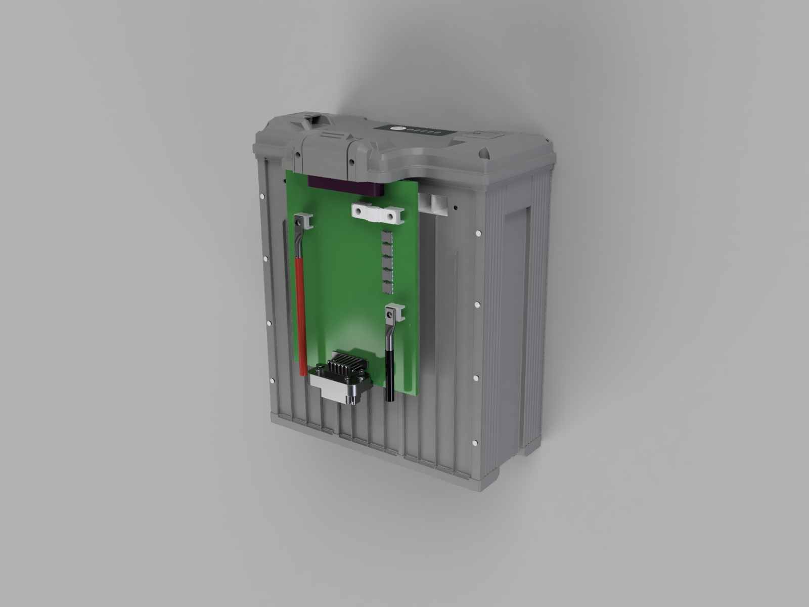
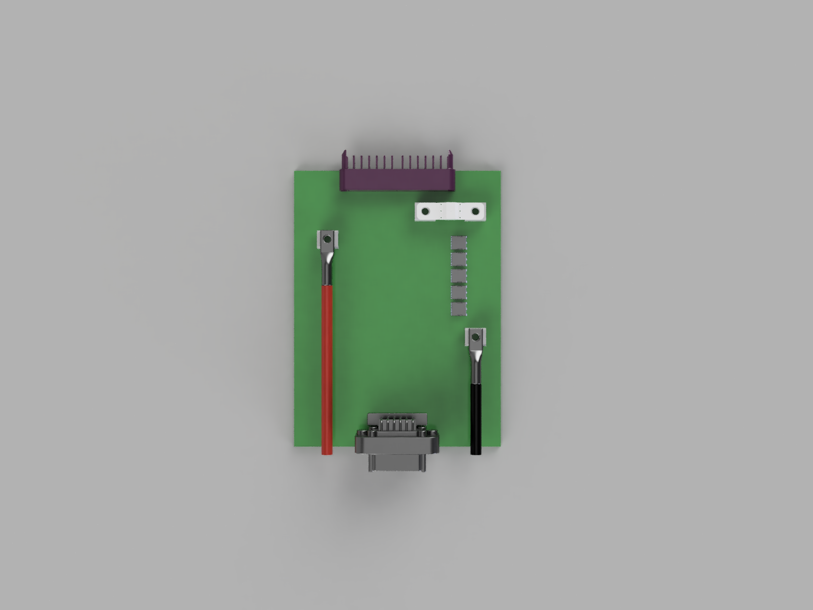

# 18SBC PCB

18-Series Battery Connector Board — a high-current PCB designed for 18S lithium battery pack integration in heavy-lift UAV systems.

## Overview

The 18SBC is a battery connector board that interfaces 18S smart battery packs (e.g. Tattu 4.0) with the aircraft electrical system.

### Design Goals

- Support 18S smart batteries (Tattu 4.0 compatible)
- Handle 100A continuous / 200A spike current
- Provide galvanically isolated 12V output (GNDE) to the aircraft power distribution board
- Provide non-isolated 5V / 3.3V (GNDI) for onboard BMS logic
- Active power switching with precharge and emergency shutoff
- Dual CAN bus communication (battery protocol + DroneCAN)
- Wireless connectivity (WiFi / BLE) for diagnostics and configuration

## Board Overview (Fusion 360 Renders)

> **Note:** These renders are for visualization purposes — the ESP32-C3, MCP2515, and other small ICs are not yet modeled in the CAD. The renders show the physical layout of the major connectors, fuse, and power path components.

### Render 1 — Board Inserted in 18S Tattu Battery



The board is shown inserted vertically into an 18S Tattu 4.0 smart battery pack to illustrate how the battery connector (purple, top) mates with the battery's interface.

**Visible components (top to bottom):**

| Position | Component | Description |
|---|---|---|
| Top | **Purple connector** (Prolanv EN60A) | Battery interface — carries power (+ / -) and CAN L/H to the PCB |
| Upper right | **White ceramic component** (AMXL-250) | 250A main fuse, bolt-mounted on 2x AMT0650009DB0000G screw terminals |
| Below fuse | **MOSFETs** | Power switching (precharge, kill switch, power enable) |
| Below MOSFETs | **Black cable** with ring lug | Negative output to Hobbywing X15 propulsion, connected via AMT0650009DB0000G screw terminal |
| Middle left | **Red cable** with ring lug | Positive output to Hobbywing X15 propulsion, connected via AMT0650009DB0000G screw terminal |
| Bottom | **AT13-12PB-BM03** signal connector | 12-position Amphenol AT series — interfaces with the drone electrical harness (12V, 5V, GND, CAN, signals) |

### Render 2 — Board Front View



Frontal view of the PCB showing component placement and general board layout. The power path flows from the battery connector (top) through the fuse and MOSFETs to the propulsion screw terminals (red/black cables). The signal connector exits at the bottom toward the drone harness.

### Signal Flow

```
Battery (18S Tattu 4.0)
        |
        v
+---------------------+
|  Purple Connector    |  <- Power (+ / -) + CAN L/H from battery
|  (Prolanv EN60A)     |
+---------------------+
|  AMXL-250 Fuse       |  <- 250A short-circuit protection
+---------------------+
|  MOSFETs             |  <- Precharge / Kill switch / Power enable
+---------------------+
|  Screw Terminals     |  <- Red (+) and Black (-) cables
|  (AMT0650009DB0000G) |     to Hobbywing X15 propulsion
+---------------------+
|                       |
|  HV Bus (54-75.6V)   |
|    |            |     |
|    v            v     |
|  [Buck]    [Push-Pull]|
|  5V/1A     12V/10A   |
|  (GNDI)    (isolated) |
|    |        (GNDE)    |
|    v            |     |
|  [LDO]         |     |
|  3.3V          |     |
|  (GNDI)        |     |
+---------------------+
|  AT Signal Connector |  <- 12V (GNDE), DroneCAN, signals
|  (AT13-12PB-BM03)   |     to aircraft harness
+---------------------+
```

## Specifications

| Parameter | Value |
|---|---|
| Configuration | 18S (18 series cell groups) |
| Max Voltage | 75.6V (4.2V x 18) |
| Nominal Voltage | 64.8V (3.6V x 18) |
| Continuous Current | 100A |
| Spike Current | 200A (short duration) |
| Board Shape | Rectangular |
| EDA Tool | KiCad 10 |
| Board Layers | TBD |

### Current Rating Justification

Based on the motor data (Hobbywing XRotor X15):

| Throttle | Thrust | Current per Motor |
|---|---|---|
| 51% | 27,257 g | 44.7 A |
| 72% | 47,933 g | 101.6 A |
| 100% | 72,647 g | 197.1 A |

The Hover throttle is ~50%. The 100A nominal rating covers normal operations; the 200A spike rating handles full-throttle bursts.

## Connectors and Fuse

### Battery Connector

**Selected: [Prolanv EN60A](https://www.prolanv.com/2_2552837_5851637.html)**

| Parameter | Value |
|---|---|
| Current per Power Pair | 60A |
| Power Pairs | 5 positive + 5 negative |
| Total Current Capacity | 300A |
| Signal Pins | 6 |
| Contact Resistance | 0.6 mOhm |
| Mating Cycles | 10,000 |
| Temperature Range | -40C to +125C |
| Mounting | Right-Angle DIP (PCB mount) |

The EN60A provides 300A total capacity across 5 power pairs, giving comfortable headroom above the 200A spike requirement. From the 6 signal pins, only 4 are used.

At 200A spike across 4 power pairs (50A each): P = I^2 x R = 50^2 x 0.0006 = 1.5W per pair = 6W total — well within thermal limits.

### Propulsion Screw Terminals

**Selected: [Amphenol Anytek AMT0650009DB0000G](https://www.mouser.com/ProductDetail/Amphenol-Anytek/AMT0650009DB0000G)**

These are the high-current screw terminals where cables to the Hobbywing X15 propulsion system are connected (+ and -).

| Parameter | Value |
|---|---|
| Type | Screw Terminal, Power Tap |
| Screw Size | M5 |
| Pins | 6 |
| Current Rating | 180A |
| Mounting | Through-Hole DIP |
| Contact Material | Brass + Steel Nut (matte tin plated) |
| Torque | 18 lbf·in |

Two sets of AMT0650009DB0000G screw terminals are used on the board: one pair for the propulsion output (+ / -), and another pair for mounting the main fuse (see below).

### Signal Connector (Drone Interface)

**Selected: [Amphenol AT13-12PB-BM03](https://www.amphenol-sine.com/AT13-12PB-BM03-12-Position-Right-Angle-Flange-Mount-PCB-Receptacle-Black-Tin-Plated-Contacts-Included-Keyed-B-Comparable-to-PN-DT13-12PB_p_9475.html) (or similar AT series)**

This connector interfaces the 18SBC with the rest of the drone's electrical system (signal lines, regulated power outputs, CAN buses).

| Parameter | Value |
|---|---|
| Series | Amphenol AT (automotive-grade) |
| Type | Right-Angle Flange Mount PCB Receptacle |
| Positions | 12 |
| Keying | B |
| Contact Plating | Tin |
| Mating Connector | AT series cable plug (wire-to-board) |

The AT series is an automotive/industrial-grade connector family designed for harsh environments — vibration-resistant, sealed, and rated for high mating cycles. The 12 positions carry the isolated 12V output (GNDE), CAN bus lines, and control signals.

### Main Fuse (Short-Circuit Protection)

**Selected: [Eaton AMXL-250](https://www.eaton.com/content/dam/eaton/products/electronic-components/resources/data-sheet/eaton-amx-amxl-automotive-bolt-in-fuse-data-sheet-elx1218-en.pdf)**

The main fuse sits between the battery connector and the power output stage, protecting against short circuits. It is mounted on two AMT0650009DB0000G screw terminals (bolt-in design).

| Parameter | Value |
|---|---|
| Type | Automotive bolt-in fuse |
| Current Rating | 250A |
| Voltage Rating | 125 Vdc |
| Body | Ceramic |
| Mounting | Bolt-in (M5 terminals) on 2x AMT0650009DB0000G |

The 250A fuse rating provides short-circuit protection while allowing the full 200A spike current without nuisance blowing. The ceramic body handles the thermal demands of high-current interruption.

## MCU and Communication

### MCU: ESP32-C3-MINI-1

The ESP32-C3-MINI-1 module is a compact RISC-V based microcontroller with integrated wireless connectivity. It includes a PCB antenna — no external antenna components are required. A keepout zone must be maintained around the antenna area on the PCB layout (no copper / ground plane underneath).

| Parameter | Value |
|---|---|
| Core | 32-bit RISC-V, 160 MHz |
| Flash | 4 MB (integrated) |
| SRAM | 400 KB |
| WiFi | 802.11 b/g/n (2.4 GHz) |
| Bluetooth | BLE 5.0 |
| GPIOs | 22 |
| SPI | 3x (1 used for dual MCP2515) |
| ADC | 6 channels, 12-bit |
| Operating Voltage | 3.0 – 3.6V |
| Deep Sleep Current | 5 uA |
| Antenna | Integrated PCB antenna |

### Dual CAN Bus (2x MCP2515 + Transceiver)

Two independent CAN networks using external MCP2515 controllers on a shared SPI bus. This provides identical timing behavior on both buses and clean separation of the battery-side and drone-side CAN domains.

| CAN Bus | Purpose | Controller | Transceiver |
|---|---|---|---|
| CAN 1 — Battery | Battery protocol (smart battery communication) | MCP2515 (SPI, CS1) | SN65HVD230 (3.3V) |
| CAN 2 — Drone | DroneCAN (UAVCAN v0) interface to aircraft | MCP2515 (SPI, CS2) | SN65HVD230 (3.3V) |

Each MCP2515 requires an 8 MHz crystal + 2x 22pF load capacitors. 120 Ohm termination resistors are optional (directly connected or selectable via solder jumper depending on bus topology).

The board converts between the battery protocol (CAN 1) and DroneCAN (CAN 2) using [libcanard](https://github.com/dronecan/libcanard).

### GPIO Allocation

| Function | GPIOs | Notes |
|---|---|---|
| SPI Bus (shared) — SCK, MOSI, MISO | 3 | Directly routed to both MCP2515 |
| MCP2515 #1 — CS1, INT1 | 2 | CAN 1 (Battery) |
| MCP2515 #2 — CS2, INT2 | 2 | CAN 2 (Drone) |
| Temperature Sensors | 2 | 1-Wire (e.g. DS18B20) or analog NTC via ADC |
| Circuit Switching | 4 | MOSFET gate drive (e.g. precharge, kill switch, power enable) |
| **Total Used** | **13** | |
| **Remaining / Reserve** | **9** | Available for future expansion |

Pin count provides comfortable headroom for all current functions with 9 GPIOs in reserve.

## Functional Requirements

### Power Path
- **High-side MOSFET switching** — N-channel MOSFETs with charge pump gate drive
- **Precharge circuit** — soft-start via resistor + relay/MOSFET to limit inrush current
- **Emergency kill switch** — hardware-level kill input, independent of MCU
- **Main fuse** — Eaton AMXL-250 (250A) bolt-in fuse for short-circuit protection

### Voltage Regulation

The power supply architecture uses two independent stages with full galvanic isolation between internal BMS logic (GNDI) and external drone systems (GNDE).

#### Internal Supply (GNDI — non-isolated)

Provides power for onboard logic (ESP32, MCP2515, CAN transceivers, gate drivers, sensors).

| Stage | Topology | IC | Input | Output | Notes |
|---|---|---|---|---|---|
| 5V Rail | Sync Buck | e.g. MP9487 or similar (100V+, integrated FETs, ≥1A) | 54–75.6V (HV Bus) | 5V / 1A | Main internal rail |
| 3.3V Rail | LDO | e.g. AMS1117-3.3 or similar | 5V | 3.3V | ESP32, MCP2515, CAN transceivers |

#### External Supply (GNDE — galvanically isolated)

Provides 12V to the aircraft power distribution board. Full galvanic isolation ensures no ground loops between the 6 battery packs in the aircraft, and prevents EMI/noise from the propulsion system reaching sensitive avionics.

| Stage | Topology | IC | Input | Output | Notes |
|---|---|---|---|---|---|
| Isolated 12V | Push-Pull | e.g. TI LM5030 or similar push-pull controller | 54–75.6V (HV Bus) | 12V / 10A (isolated) | 1:N transformer, GNDI ↔ GNDE fully isolated |

> **Isolation rationale:** The aircraft uses 6 independent battery packs, each with its own 18SBC. All 6 isolated 12V outputs are combined on a central power distribution board. Without isolation, all battery GNDs would be connected through the shared 12V/5V rails — creating ground loops and coupling propulsion noise into avionics. Galvanic isolation on each 18SBC prevents this.

### Monitoring and Communication
- **Dual CAN bus** — see [MCU and Communication](#mcu-and-communication) section above
- **Temperature sensors** — 2 pins reserved for monitoring battery connector and MOSFET hotspots (1-Wire or NTC/ADC)
- **WiFi / BLE** — integrated in ESP32-C3 for wireless diagnostics, configuration, and telemetry

### Protection
- **Short circuit protection** — Eaton AMXL-250 bolt-in fuse (250A, 125Vdc) mounted on dedicated screw terminals

## Repository Structure

```
18SBC_PCB/
├── README.md
├── kicad/              # KiCad 10 project files
│   ├── 18SBC.kicad_pro
│   ├── 18SBC.kicad_sch
│   └── 18SBC.kicad_pcb
├── docs/               # Documentation and datasheets
├── manufacturing/      # Gerber files and BOM
├── firmware/           # ESP32-C3 firmware (ESP-IDF / Arduino)
└── images/             # Board renders and photos
```

## Deliverables

1. **Schematic** — complete KiCad schematic with all subsystems
2. **PCB Layout** — rectangular board, routed for high current, antenna keepout zone respected
3. **BOM** — full bill of materials with supplier links
4. **Gerber files** — manufacturing-ready output for JLCPCB
5. **Documentation** — kicad files with component/footprint libraries in a zip folder.

## Getting Started

1. Install [KiCad 10](https://www.kicad.org/)
2. Clone this repository
3. Open `kicad/18SBC.kicad_pro`

## Reference Links

- [ESP32-C3-MINI-1 Datasheet](https://www.espressif.com/sites/default/files/documentation/esp32-c3-mini-1_datasheet_en.pdf) — MCU module
- [MCP2515 Datasheet](https://ww1.microchip.com/downloads/en/DeviceDoc/MCP2515-Stand-Alone-CAN-Controller-with-SPI-20001801J.pdf) — CAN controller
- [SN65HVD230 Datasheet](https://www.ti.com/lit/ds/symlink/sn65hvd230.pdf) — 3.3V CAN transceiver
- [AMT0650009DB0000G (Mouser)](https://www.mouser.com/ProductDetail/Amphenol-Anytek/AMT0650009DB0000G) — 180A screw terminal (propulsion + fuse mount)
- [AT13-12PB-BM03 (Amphenol)](https://www.amphenol-sine.com/AT13-12PB-BM03-12-Position-Right-Angle-Flange-Mount-PCB-Receptacle-Black-Tin-Plated-Contacts-Included-Keyed-B-Comparable-to-PN-DT13-12PB_p_9475.html) — 12-pos signal connector
- [Eaton AMXL-250 Datasheet (PDF)](https://www.eaton.com/content/dam/eaton/products/electronic-components/resources/data-sheet/eaton-amx-amxl-automotive-bolt-in-fuse-data-sheet-elx1218-en.pdf) — 250A bolt-in fuse
- [DroneCAN](https://dronecan.github.io/) — CAN protocol for UAVs
- [libcanard](https://github.com/dronecan/libcanard) — lightweight DroneCAN implementation in C
- [Prolanv EN60A Connector](https://www.prolanv.com/2_2552837_5851637.html) — battery connector datasheet

## License

TBD
